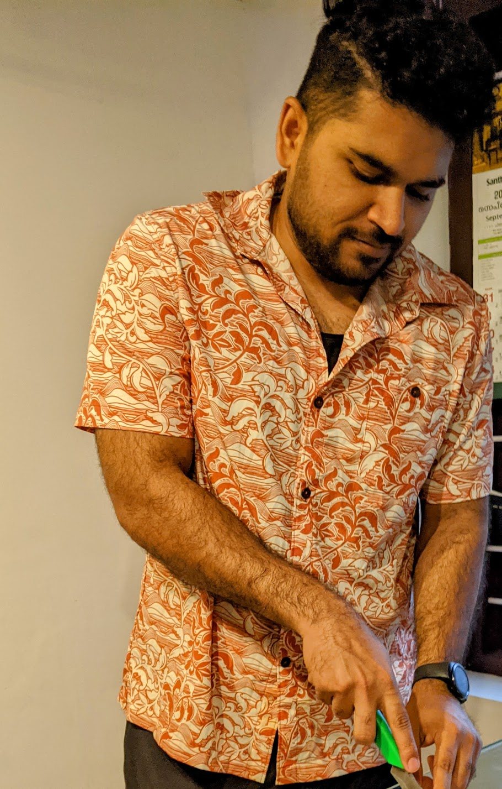

# About Me 

Check out my new webpage here: [https://aputhukkudy.com](https://aputhukkudy.com) - Some of the information in aninramesh.github.io may be outdated.

Hello,

I am a dedicated Atmospheric Physicist holding a Ph.D. from the University of Maryland Baltimore County (UMBC), USA. My area of expertise lies in aerosol measurement and instrumentation, and I possess a strong foundation in programming languages such as Matlab and Python. I am particularly enthusiastic about the application of aerosol remote sensing techniques and the development of inverse methods to determine aerosol properties using multi-angle polarimetric observations.

Throughout my academic career, I have accumulated extensive experience working with the HARP family of polarimeter data, and I have successfully employed the GRASP algorithm to retrieve aerosol properties. My interest in this field began during my undergraduate studies in Physics when I contributed to a project focused on constructing a cavity-based spectrometer for the purpose of measuring trace gases in the atmosphere.

Upon joining UMBC as a graduate student in 2014, my research interests expanded to encompass both in situ and remote sensing measurements of aerosols. Beyond my passion for atmospheric research, I am an avid backpacker who enjoys exploring national forests, an enthusiastic learner always eager to acquire new technological skills, and an informed individual who remains abreast of current events.

As a valued member of our team, I am committed to advancing the understanding of aerosols and their impact on the environment. My goal is to contribute significantly to the development of cutting-edge remote sensing techniques and to the broader scientific community, while inspiring others to explore and appreciate the wonders of atmospheric physics.

 

# Research Interest

* Research, design, develop, implement, and support decision-science models
* Aerosol measurement and instrumentation
* Remote sensing of aerosols and clouds using multi-angle imaging polarimeters

# News
* [CIDER 2024 Award](https://esi.umbc.edu/post/146857/)

# Publications

## Peer reviewed
1. McBride, B. A., Martins, J. V., Cieslak, J. D., Fernandez-Borda, R., **Puthukkudy, A.**, Xu, X., Sienkiewicz, N., Cairns, B., and Barbosa, H. M. J.: Pre-launch calibration and validation of the Airborne Hyper-Angular Rainbow Polarimeter (AirHARP) instrument, Atmos. Meas. Tech., 17, 5709–5729, https://doi.org/10.5194/amt-17-5709-2024, 2024

1. Sienkiewicz, N., Martins, J. V., McBride, B. A., Xu, X., **Puthukkudy, A.**, Smith, R., and Fernandez-Borda, R.: HARP2 Pre-Launch Calibration Overview: The Effects of a Wide Field of View, EGUsphere [preprint], https://doi.org/10.5194/egusphere-2024-2024, 2024.
  
1. McBride, B. A., Sienkiewicz, N., Xu, X., **Puthukkudy, A.**, Fernandez-Borda, R., & Martins, J. V. (2024, November). In-flight characterization of the Hyper-Angular Rainbow Polarimeter (HARP2) on the NASA PACE mission. In Sensors, Systems, and Next-Generation Satellites XXVIII (Vol. 13192, pp. 113-122). SPIE.

1. Martins, J. V., Fernandez-Borda, R. A., **Puthukkudy, A.**, Xu, X., Sienkiewicz, N., Smith, R., ... & Remer, L. A. (2024, November). First results and on-orbit performance of the Hyper-Angular Rainbow Polarimeter (HARP2) on the PACE satellite. In Sensors, Systems, and Next-Generation Satellites XXVIII (Vol. 13192, pp. 42-51). SPIE.

2. Gao, M., Franz, B. A., Zhai, P.-W., Knobelspiesse, K., Sayer, A. M., Xu, X., Martins, J. V., Cairns, B., Castellanos, P., Fu, G., Hannadige, N., Hasekamp, O., Hu, Y., Ibrahim, A., Patt, F., **Puthukkudy, A.**, and Werdell, P. J.: Simultaneous retrieval of aerosol and ocean properties from PACE HARP2 with uncertainty assessment using cascading neural network radiative transfer models, Atmos. Meas. Tech., 16, 5863–5881, https://doi.org/10.5194/amt-16-5863-2023, 2023.

1. Dubovik, O., ..., **Puthukkudy, A.**, ... *"A Comprehensive Description of Multi-Term LSM for Applying Multiple a Priori Constraints in Problems of Atmospheric Remote Sensing: GRASP Algorithm, Concept, and Applications."* Front. Remote Sens. 2: 706851. doi: 10.3389/frsen (2021).

1. Gao, M., ... , **Puthukkudy, A.**, ... *"Efficient multi-angle polarimetric inversion of aerosols and ocean color powered by a deep neural network forward model"*, Atmos. Meas. Tech., 14, 4083–4110, [link](https://doi.org/10.5194/amt-14-4083-2021), 2021.

1. **Puthukkudy, A.**, Martins, J. V., ....*"Retrieval of aerosol properties from Airborne Hyper Angular
Rainbow Polarimeter (AirHARP) observations during ACEPOL 2017" AMTD-2020-64 [link](https://www.atmos-meas-tech-discuss.net/amt-2020-64/)

2. Knobelspiesse, K. D., Cook, A. L., Hair, J. W., Harper, D. B., Hostetler, C. A., Maring, H., ...,**Puthukkudy, A**.,...Tan, Q. (2019). *"The Aerosol Characterization from Polarimeter and Lidar (ACEPOL) airborne field campaign"*. ESSD(submitted).

3. Espinosa, W.R., Martins, J.V., Remer, L.A., Dubovik, O., Lapyonok, T., Fuertes, D., **Puthukkudy, A.**, Orozco, D., Ziemba, L., Thornhill, K.L. and Levy, R., 2019. *Retrievals of Aerosol Size Distribution, Spherical Fraction, and Complex Refractive Index From Airborne In Situ Angular Light Scattering and Absorption Measurements*. Journal of Geophysical Research: Atmospheres, 124(14), pp.7997-8024.

4. Espinosa, W.R., Martins, J.V., Remer, L.A., **Puthukkudy, A.**, Orozco, D. and Dolgos, G., 2018. *In situ measurements of angular-dependent light scattering by aerosols over the contiguous United States*. Atmospheric Chemistry and Physics, 18(5), pp.3737-3754.

5. Chandran, S., **Puthukkudy, A**. and Varma, R., 2017. *Dual-wavelength dual-cavity spectrometer for NO 2 detection in the presence of aerosol interference*. Applied Physics B, 123(7), p.213.

## Conferences

1. Talk at AGU Fall Meeting 2024 on "Retrieving Aerosol and Surface Products Using Mul-ti-Pixel approach from PACE Polarimeter HARP2 Observations with GRASP", Washington DC, US, December, 2024
2. Talk at APOLO 2024 on "Aerosol and Surface Products from PACE Polarime-ter HARP2 Observations using GRASP", Kyoto, Japan, November, 2024
3. Invited talk at NASA GSFC on “Preliminary aerosol retrievals from HARP2”, NASA GSFC, May, 2024
4. Talk at the CAMP2Ex science team meeting 2024, “Assessment of Aerosol Retrieval Accuracy with Multi-Angle Polarimeters Using Synthetic Data and Particle Size Distribution from the CAMP2Ex Field Campaign”, February 28, 2024, Pasadena, CA
5. Invited talk at Workshop on “Recent advancements in remote sensing and modeling of aerosols, clouds and surfaces”: "Aerosol and Cloud Observations from Space with HARP CubeSat.", Univ. of Lille, France, May 2023
6. Talk at International Astronautical Congress 2022 : “HARP: A 3U CubeSat for aerosol and cloud observations”, 73rd IAC, Paris, France on 18 to 22 September 2022 (Paper no.: IAC-22/B4/4.7x72125)
7. Talk at AGU2022 Fall meeting: “An assessment of the effectiveness of multi-angle polarimeter aerosol retrievals based on data from the CAMP2Ex field campaign.”. Puthukkudy, A., Espinosa, R., Reid, J.S., Wang, J., Xiao, Q., Ziemba, L.D., Dubovik, O. and Martins, J.V., 2022, December. “An assessment of the effectiveness of multi-angle polarimeter aerosol retrievals based on data from the CAMP2Ex field campaign”. In AGU Fall Meeting Abstracts (Vol. 2022, pp. A55B-06).
8. **Puthukkudy, Anin** et. al *Retrieval of aerosol properties from Airborne Hyper-Angular Rainbow Polarimeter (AirHARP) observations during the 2017 ACEPOL campaign* in Advancement of POLarimetric Observations: instruments, calibration, and improved aerosol and cloud retrievals(APOLO) - 2019 ([Talk](https://www.giss.nasa.gov/staff/mmishchenko/APOLO-2/Abstracts/Puthukkudy.pdf))

1. **Puthukkudy, A.**, McBride, B., Remer, L., Martins, J.V., Barbosa, H.M. and Dubovik, O., 2018, December. *Retrieval of Aerosol properties using GRASP from AirHARP observations*. In AGU Fall Meeting 2018. AGU.

1. Espinosa, R., Remer, L., Martins, J.V., Dubovik, O., Lapyonok, T., Fuertes, D., **Puthukkudy, A.**, Orozco, D. and Levy, R.C., 2018, December. *Aerosol Size Distribution, Complex Refractive Index and Spherical Fraction Retrieved from Airborne In Situ Angular Light Scattering and Absorption Measurements*. In AGU Fall Meeting Abstracts.

1. **Puthukkudy, A.**, Espinosa, R., Lima, A.R., Remer, L., Colarco, P., Whelley, P., Krotkov, N., Young, K., Dubovik, O., Wallace, K. and Martins, J.V., 2017, December. *Microphysical Properties of Alaskan Volcanic Ash*. In AGU Fall Meeting Abstracts. [Poster PDF](attachments/aerosat_2018.pdf)

1. Espinosa, R., Remer, L., **Puthukkudy, A.**, Orozco, D., Dubovik, O. and Martins, J.V., 2017, December. *Airborne characterization of aerosols over the contiguous United States during the SEAC4RS and DC3 campaigns: an in situ light scattering perspective*. In AGU Fall Meeting Abstracts.

# Education
~~~
Ph.D. in Atmospheric Physics (Fall 2021)

University of Maryland Baltimore County, USA

Thesis: Retrieval of aerosol properties using Polarized Imaging Nephelometer (PI-Neph) laboratory measurements and Hyper-Angular Rainbow Polarimeter (HARP) remote sensing observations

Completed PhD candidacy in 2018

Advisor:Prof. J. Vanderlei Martins

~~~

~~~
Masters in Atmospheric Physics (December 2016)

University of Maryland Baltimore County, USA
~~~

~~~
Bachelor of Technology in Engineering Physics (Decemebr 2013)

National Institute of Techonolgy, Calicut

Thesis: Incoherent Broadband Cavity Enhanced Absorption Spectroscopy for the detection of trace gases using deep red LED

Advisor:Prof. M K Ravi Varma

~~~

# Computer Skills

Expertise | Language  or Software |
----------|-----------------------|
Basic     | C, C++, HTML, BASH, FORTRAN 90, LATEX |
Intermediate | SOLIDWORKS, LabVIEW |
Expert | MATLAB, Python |

# Awards and Recognition

Year | Award | Category
-----|-------|--------
2025 | CIDER2024 | An AI-driven approach for retrieving aerosol and surface properties from HARP family of multi-angle polarimeter measurements |
2019 | Travel Fellowship | Received travel fellowship to attend APOLO19 (NASA-GISS, University of IOWA)
2017-2018 | [Graduate Student Fellowship](https://jcet.umbc.edu/?id=68416) |  Joint Center for Earth Systems Technology, UMBC
2013 | Best Intern | Won Best Intern award from Banyan Scientific
2010-2013 | E-grantz fellow | Won fellowship for the undergraduates by Kerala state government

---

# Links
* [ResearchGate](https://researchgate.net/profile/Anin_Puthukkudy2)

* [Google Scholar](https://scholar.google.com/citations?user=jxOxXa8AAAAJ&hl=en&oi=ao)

* [LinkedIn](https://www.linkedin.com/in/anin-puthukkudy/)

